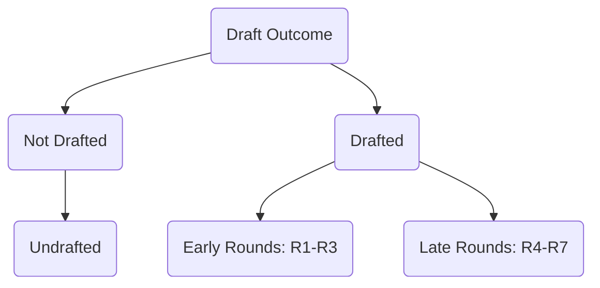

# Detailed EDA Report: NFL Combine (2010 - 2023)

This walkthrough presents the results of the Exploratory Data Analysis (EDA) performed in [EDA_nfl_combine.ipynb](file:///c:/Users/56965/Documents/Nfl%20draft/EDA_nfl_combine.ipynb) using the [nfl_combine_2010_to_2023.csv](file:///c:/Users/56965/Documents/Nfl%20draft/nfl_combine_2010_to_2023.csv) dataset.

---

## 📊 Summary of Dataset Structure
* **Total Observations:** 4,741 players.
* **Features:** 15 columns, including physical traits (`Height`, `Weight`), athletic performances (`40yd`, `Vertical`, `Bench`, `Broad Jump`, `3Cone`, `Shuttle`), and draft outcomes (`Drafted`, `Round`, `Pick`).

---

## 🧹 1. Missing Values and Preprocessing

### 1.1 Height Conversion
The original `Height` was represented as a text string (e.g., `6-3`). We successfully converted it to a numeric feature (`Height_inches`) by calculating $\text{Feet} \times 12 + \text{Inches}$ (e.g., `6-3` $\rightarrow$ 75 inches).

### 1.2 Analysis of Missing Values
Combine participants frequently skip certain drills based on advice from their agents or existing injuries.
* `3Cone` (~41% missing) and `Shuttle` (~38% missing) have the highest missingness rates.
* `Bench Press` has ~33% missing values.
* Target columns `Round` and `Pick` have exactly 36.5% missing values (representing the 1,733 undrafted players).

> [!NOTE]
> **Imputation Strategy:** Rather than dropping records with missing values (which would significantly bias our dataset towards players who completed every drill), we imputed missing values using the **median metric of each player's specific position group**. This preserves sample size and accounts for the physical differences between positions.

---

## 🎯 2. Univariate Analysis (The Choice & Demographics)

### 2.1 The Choice Outcomes
* **Drafted vs. Undrafted:** 63.4% of players in the combine dataset (3,008 players) were drafted, while 36.6% (1,733 players) went undrafted.
* **Draft Round Distribution:** The draft rounds are relatively uniform, with Rounds 1 through 5 having roughly 430-500 players each, and Rounds 6 and 7 having slightly fewer (due to historical pick distributions in the dataset).

### 2.2 Position Distribution
Wide Receivers (`WR`) and Cornerbacks (`CB`) are the most frequent position groups at the combine, while specialists like Long Snappers (`LS`), Kickers (`K`), and Punters (`P`) are rare.

---

## ⚡ 3. Athletic Metrics Distributions and Relationships

### 3.1 Histograms of Key Combine Metrics
Most combine metrics show a bell-shaped normal distribution, except for some slight skewness:
* `Weight` is bimodal, representing two distinct physical structures in the NFL: skill/speed players (180–230 lbs) and linemen (300+ lbs).
* `40yd` dash times show a corresponding spread, reflecting the separation of positions.

### 3.2 Correlation Heatmap
Understanding correlations helps check for multicollinearity before fitting discrete choice models.

* **Weight vs. Speed:** A strong positive correlation (+0.82) exists between `Weight` and `40yd` times (heavier players are slower).
* **Speed vs. Jumps:** A strong negative correlation exists between `40yd` times and both `Vertical` (-0.71) and `Broad Jump` (-0.73), indicating that speed and vertical explosive power are highly correlated.

---

## 🏷️ 4. Bivariate Analysis: Drafted vs. Undrafted

Comparing the physical and performance metrics between drafted and undrafted players shows clear differences:
* Drafted players have **lower 40-yard dash times** (median ~4.65s vs ~4.78s), indicating they are faster.
* Drafted players have **higher vertical jumps** and **longer broad jumps**, showing superior explosiveness.

---

## 🏈 5. The Critical Importance of Position Context

Standardizing raw metrics is essential. A 300 lb offensive tackle running a 4.90s 40-yard dash is exceptionally fast for their size, whereas a 180 lb wide receiver running a 4.90s is considered extremely slow.

### 5.1 40yd Dash by Position
The median and range of speed vary drastically by position group. Wide Receivers (`WR`) and Cornerbacks (`CB`) cluster under 4.6s, whereas Offensive Tackles (`OT`) and Guards (`OG`) cluster above 5.1s.

### 5.2 Weight by Position
Weights split the combine cleanly into three groups:
1. **Light/Skill:** WR, CB, S, RB (~190–215 lbs).
2. **Medium/Explosive:** LB, TE, DE, EDGE (~235–260 lbs).
3. **Heavy/Power:** OT, OG, C, DT (~300–315 lbs).

> [!TIP]
> **Recommendation:** Standardize all metrics within position groups using Z-scores ($Z = \frac{X - \mu_{pos}}{\sigma_{pos}}$). This represents how a player compares to *their direct peers*, which is how NFL front offices actually evaluate them. We have implemented this and saved the columns (e.g., `40yd_z`, `Weight_z`) in the cleaned output file.

---

## 🛠️ 6. Proposed Discrete Choice Models

Using the cleaned dataset [nfl_combine_cleaned.csv](file:///c:/Users/56965/Documents/Nfl%20draft/nfl_combine_cleaned.csv), you can pursue three modeling paths:

### Path A: Binary Logit Model (Drafted vs. Undrafted)
* **Decision Maker ($i$):** NFL Teams (acting collectively).
* **Alternatives ($j$):** 
  * $j = 1$: Player is Drafted ($Y_i = 1$)
  * $j = 0$: Player is Not Drafted ($Y_i = 0$)
* **Utility ($U_{ij}$):**
  * $U_{i0} = 0$ (Reference)
  * $U_{i1} = \beta_0 + \beta_1 \cdot \text{Height\_z}_i + \beta_2 \cdot \text{Weight\_z}_i + \beta_3 \cdot \text{40yd\_z}_i + \beta_4 \cdot \text{Vertical\_z}_i + \beta_5 \cdot \text{Bench\_z}_i + \epsilon_{i}$

### Path B: Nested Logit Model (Draft Round Nests)
* **Alternatives ($j$):** $\{UD, Early, Late\}$
* **Nests:** 
  * Nest 1 (Undrafted): $\{UD\}$
  * Nest 2 (Drafted): $\{Early, Late\}$
* **Reasoning:** Solves the Independence of Irrelevant Alternatives (IIA) assumption since draft rounds inside the "Drafted" category are closer substitutes to each other than the "Undrafted" category.

#### 📊 Estimation Results & Diagnostics
We successfully estimated the Nested Logit Model in [Nested_Logit_NFL_Draft.ipynb](file:///c:/Users/56965/Documents/Nfl%20draft/Nested_Logit_NFL_Draft.ipynb) and compared it to a baseline Multinomial Logit (MNL) model.

* **Goodness-of-Fit Comparison:**
  * **Multinomial Logit (MNL):** $LL = -3,340.66$, McFadden's Adj. $\rho^2 = 0.0863$, $K = 12$
  * **Nested Logit:** $LL = -3,336.61$, McFadden's Adj. $\rho^2 = 0.0921$, $K = 14$
* **Likelihood Ratio (LR) Test:**
  * $LR = 2 \times (LL_{\text{Nested}} - LL_{\text{MNL}}) = 8.1033$
  * Degrees of Freedom: $2$ (critical value at 5% is $5.99$)
  * **p-value = 0.0174** (statistically significant, confirming that the Nested Logit is a superior fit and that the IIA assumption is indeed violated at the flat level).

#### 🧠 Econometric Interpretation
1. **The Logsum Parameter ($\lambda_{\text{Drafted}}$):**
   * The estimated logsum parameter is $\lambda_{\text{Drafted}} = e^{-5.158876} \approx 0.0057$.
   * This very small value indicates that the alternatives "Early" and "Late" are near-perfect substitutes (error correlation approaches 1), and that the draft decision is highly hierarchical.
2. **Coefficient Alignment:**
   * Due to the $1 / \lambda_{\text{Drafted}}$ scaling factor, the choice probabilities inside the nest are highly sensitive to differences in player features.
   * To maintain numerical stability, the optimizer aligns the raw coefficients for Early and Late draft statuses to be almost identical (e.g., speed `40yd_z` coefficient is $-0.771$ for Early and $-0.768$ for Late).
3. **Athletic Metric Impacts:**
   * Speed (`40yd_z` coefficient $\approx -0.77$) is the single most critical predictor of draft success (lower Z-score indicates faster sprint times and higher utility).
   * Explosiveness (`Vertical_z` $\approx +0.14$), Strength (`Bench_z` $\approx +0.13$), and size (`Weight_z` $\approx +0.32$) all significantly increase draft utility. Height has a minor positive but statistically insignificant effect.

### Path C: Multinomial Logit Model (Position Choice)
* **Decision Maker ($i$):** High school/college athletes choosing their position.
* **Alternatives ($j$):** Position categories $\{QB, WR, RB, OL, DL, DB, LB\}$.
* **Utility ($U_{ij}$):**
  * $U_{ij} = \alpha_j + \beta_{j1} \cdot \text{Height}_i + \beta_{j2} \cdot \text{Weight}_i + \beta_{j3} \cdot \text{40yd}_i + \epsilon_{ij}$
* **Reasoning:** Since the athlete's attributes ($X_i$) do not vary across position alternatives, we estimate alternative-specific parameters $\beta_{j}$ for each trait.
